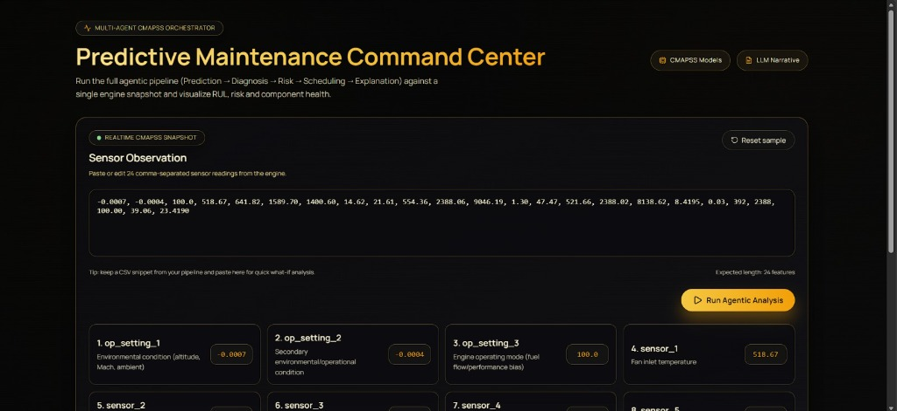
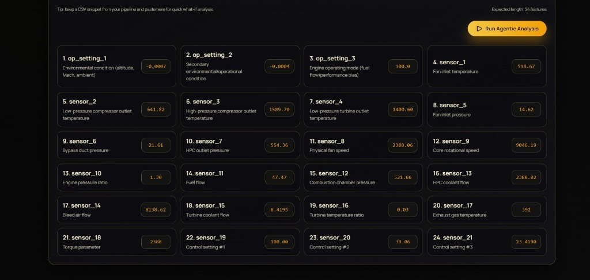
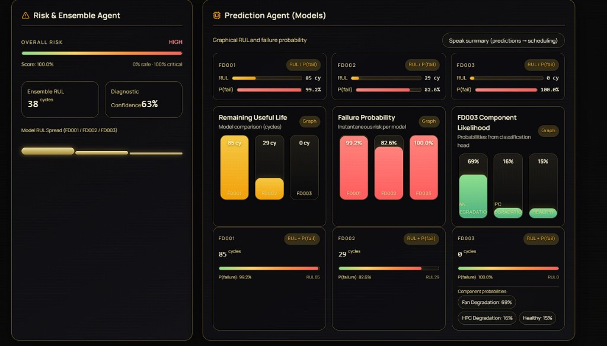
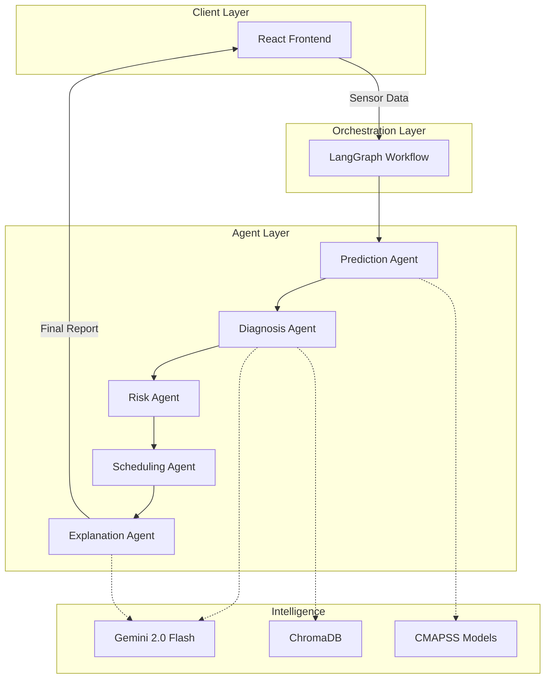

<div align="center">

  

  <br />

  [](https://opensource.org/licenses/MIT)
  [](https://www.python.org/)
  [](https://reactjs.org/)
  [](https://langchain-ai.github.io/langgraph/)
  [](https://deepmind.google/technologies/gemini/)

  <h3>🚀 AI-Driven Predictive Maintenance for Turbofan Engines</h3>

  <p>
    <a href="#-features">Features</a> •
    <a href="#-architecture">Architecture</a> •
    <a href="#-tech-stack">Tech Stack</a> •
    <a href="#-quick-start">Quick Start</a> •
    <a href="#-api-reference">API</a>
  </p>
</div>

<br />

> [!TIP]
> **Live Demo**: Watch the system diagnose engine failures in real-time!
>
> <div align="center">
>   
> </div>

## 📸 Interface Preview

<div align="center">
  <table>
    <tr>
      <td align="center">
        <b>Real-time Sensor Input</b><br/>
        
      </td>
      <td align="center">
        <b>Risk & Ensemble Analysis</b><br/>
        
      </td>
    </tr>
    <tr>
      <td align="center">
        <b>Service Scheduler</b><br/>
        
      </td>
      <td align="center">
        <b>Command Center</b><br/>
        
      </td>
    </tr>
  </table>
</div>

## 📖 Overview

The **Predictive Maintenance System** is a cutting-edge multi-agent AI platform designed to predict, diagnose, and prevent turbofan engine failures. By combining **NASA CMAPSS models** with **LangGraph agents** and **Google Gemini 2.0**, it transforms raw sensor data into actionable maintenance intelligence.

Unlike traditional systems that only output numbers, this system **reasons** about failures, explains **why** they are happening, and recommends **when** to fix them.

## ✨ Features

| Feature | Description |
| :--- | :--- |
| 🤖 **Multi-Agent Orchestration** | 5 specialized agents (Prediction, Diagnosis, Risk, Scheduling, Explanation) working in harmony. |
| 🧠 **Hybrid Intelligence** | Combines Random Forest ensembles with Large Language Model reasoning. |
| 🔍 **Vector Search Diagnosis** | Uses **ChromaDB** to find similar historical failure patterns for accurate root cause analysis. |
| 📊 **Unified Inference** | Robust pipeline handling 3 different CMAPSS datasets (FD001, FD002, FD003) simultaneously. |
| 🛡️ **Risk Assessment** | Dynamic risk scoring based on RUL (Remaining Useful Life) and failure probability. |
| 📝 **Natural Language Reports** | Generates human-readable technical reports explaining the "What", "Why", and "How". |

## 🏗 Architecture

The system follows a **state-machine architecture** orchestrated by LangGraph. Data flows through a pipeline of agents, each enriching the global state.



## 🛠 Tech Stack

<div align="center">
  <table>
    <tr>
      <td align="center"><b>Backend</b></td>
      <td align="center"><b>Frontend</b></td>
      <td align="center"><b>AI & ML</b></td>
      <td align="center"><b>Data & Ops</b></td>
    </tr>
    <tr>
      <td>
        
      </td>
      <td>
        
      </td>
      <td>
        
      </td>
      <td>
        
      </td>
    </tr>
  </table>
</div>

-   **Core**: Python 3.10+, Flask
-   **Orchestration**: LangGraph
-   **LLM**: Google Gemini 2.0 Flash (`google-generativeai`)
-   **ML**: Scikit-learn, LightGBM, NumPy, Pandas
-   **Vector DB**: ChromaDB / Pinecone
-   **Frontend**: React, Vite, Lucide Icons, Framer Motion

## 🚀 Quick Start

### Prerequisites
-   Python 3.10+
-   Node.js 18+
-   Google Gemini API Key

### 1. Backend Setup

```bash
# Clone the repository
git clone https://github.com/yourusername/predictive-maintenance-system.git
cd predictive-maintenance-system

# Create virtual environment
python -m venv venv
source venv/bin/activate  # On Windows: venv\Scripts\activate

# Install dependencies
pip install -r requirements.txt

# Set up environment variables
echo "GOOGLE_API_KEY=your_api_key_here" > .env

# Run the server
python server.py
```

### 2. Frontend Setup

```bash
cd client

# Install dependencies
npm install

# Run development server
npm run dev
```

Visit `http://localhost:5173` to access the dashboard.

## 🔌 API Reference

### `POST /api/analyze`

Analyzes sensor data and returns a comprehensive maintenance report.

**Request:**
```json
{
  "observation": [-0.0007, -0.0004, 100.0, 518.67, 641.82, ...] // 24 sensor values
}
```

**Response:**
```json
{
  "predictions": { "rul": 112, "failure_prob": 0.02 },
  "diagnosis": { "component": "High Pressure Compressor", "confidence": 0.85 },
  "risk_assessment": { "level": "LOW", "score": 0.15 },
  "final_report": { "narrative": "The engine is operating within normal parameters..." }
}
```

## 📂 Project Structure

```
predictive-maintenance-system/
├── assets/              # Static assets for README
├── client/              # React Frontend
├── src/
│   ├── agents/          # LangGraph Agents (Prediction, Diagnosis, etc.)
│   ├── inference/       # ML Model Inference Logic
│   ├── vector_db/       # ChromaDB/Pinecone wrappers
│   └── workflow.py      # Main Orchestration Graph
├── models/              # Pre-trained .pkl models
├── server.py            # Flask API Entry Point
└── requirements.txt     # Python Dependencies
```

---

<div align="center">
  <br/>
  
  <h3>Made with ❤️ by Team Hackstreet</h3>
</div>
